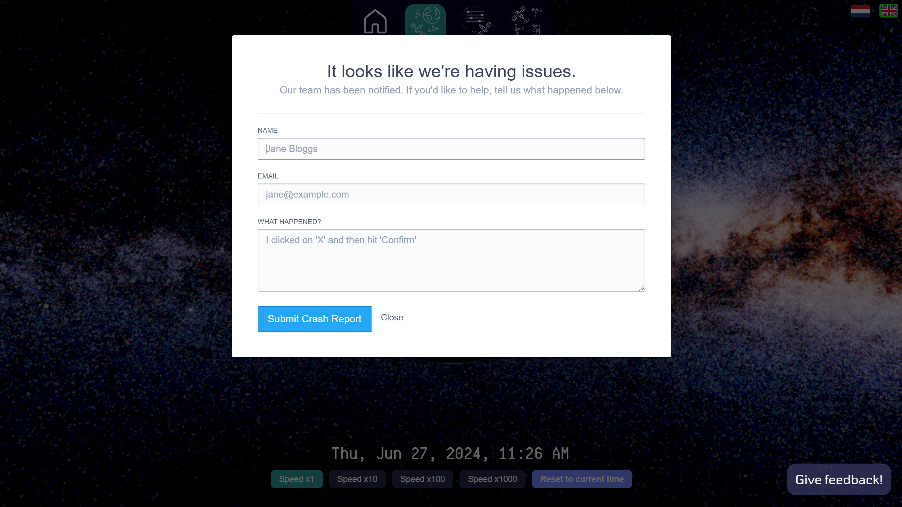
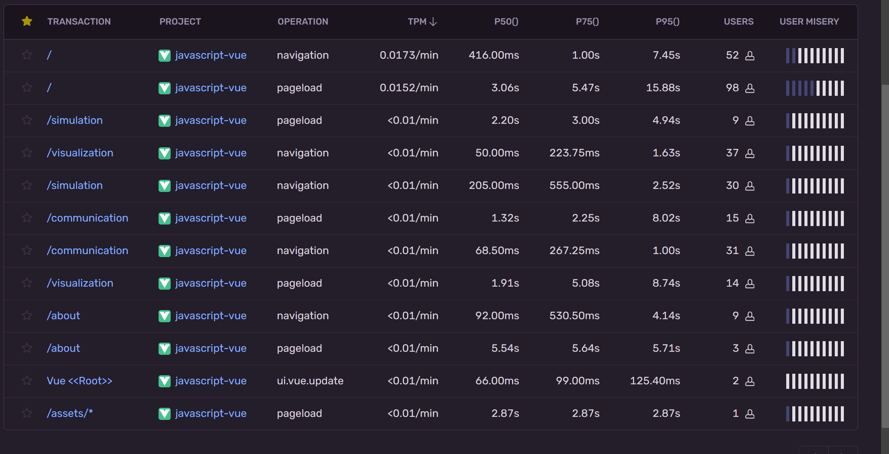

# Testing in our application

## Frontend

For frontend testing, we make sure all the types are correct. This is done with typescript, then we build the application.


When building, we also run eslint, which checks for common javascript mistakes. This is done with the following command:

```bash
npm run lint
```


This will unfortunately not fix all the issues, to provide information on errors happening on someone elses computer, we use Sentry. This is a service that logs errors happening in the application. This is configured in `main.ts` for the frontend, and `settings.py` for the backend. When the application crashes, the users see an error similar to the one below:


Sentry also gives us performance metrics, which is useful for debugging performance issues. A screenshot can be found below:



## Backend

The back-end uses Django's built-in testing tools for testing. To execute the tests, navigate to the `pse_backend` directory and run:
```
python3 manage.py test
```

Currently only the endpoints are tested.